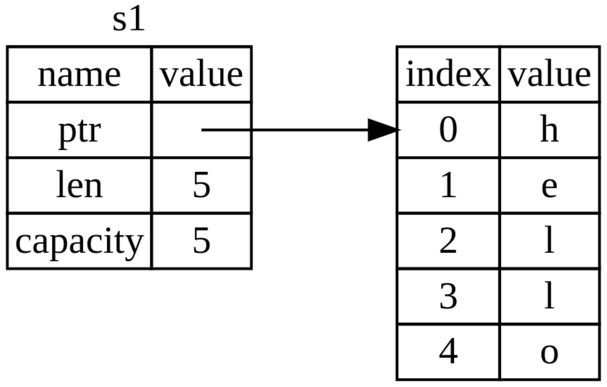
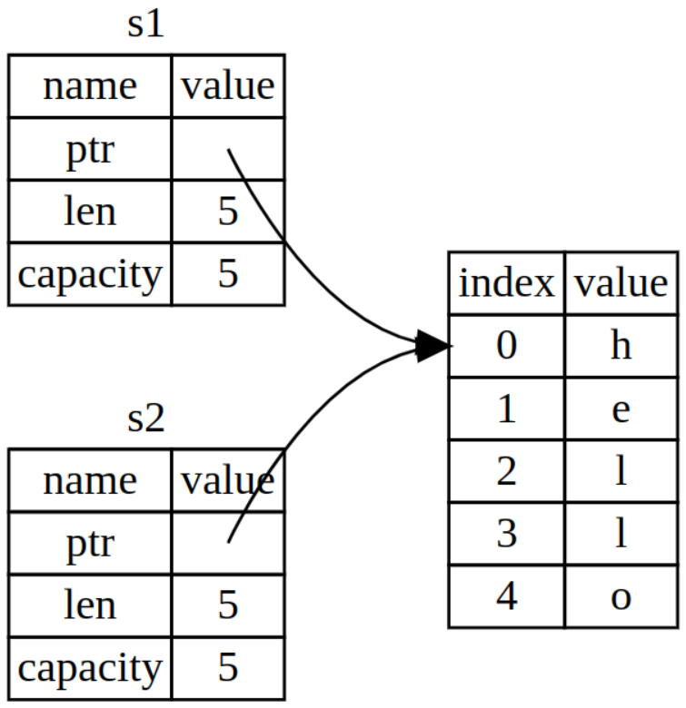
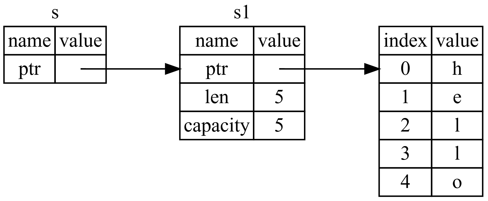

# Ownership

---

- [What Is Ownership](#what-is-ownership)
  - [Stack and Heap](#stack-and-heap)
    - [Stack](#stack)
    - [Heap](#heap)
    - [Stack vs Heap](#stack-vs-heap)
  - [Ownerhsip Rules](#ownerhsip-rules)
  - [Variable Scope](#variable-scope)
  - [`String` Type](#string-type)
  - [Memory and Allocation](#memory-and-allocation)
    - [Variables and Data Interacting with *Move*](#variables-and-data-interacting-with-move)
    - [Variables and Data Interacting with *Clone*](#variables-and-data-interacting-with-clone)
    - [Stack-Only Data: *Copy*](#stack-only-data-copy)
  - [Ownership and Functions](#ownership-and-functions)
  - [Return Values and Scope](#return-values-and-scope)
- [References and Borrowing](#references-and-borrowing)
  - [Mutable Reference](#mutable-reference)

---

- Rust's most unique feature
- Has deep implications for the rest of the language
- **Allows to make memory safety guarantees without needing a GC**
- Other related features
  - Borrowing
  - Slices
  - How Rust lays out data in memory

## What Is Ownership

- **A set of rules that governs how a Rust program manages memory**
  - All programs must manage memory while running
  - Some languages use GC or ARC to clear memory during runtime: Go, Python, C#, Java, ECMAScript, Swift
  - Other languages must have their memory managed manually and explicitly: C, C++, Pascal, Fotran, Zig
- Rust uses a different approach
  - **Memory is managed through a system of ownership**
  - **There are a set of rules that the compiler checks**
  - **If any of the rules are violated, the program will not compile**
  - **None of the features of ownership will slow down the program during runtime**
- Understanding *Ownership* gives a solid foundation for understanding the features that make Rust unique

### Stack and Heap

- **In system programming language, understanding Stack and Heap is essential**
  - Whether a value is on the Stack or the Heap affects how the language behaves
  - Also affects why you have to make certain decisions
  - *Parts of Ownership is described in relation to the Stack and the Heap*
- **Stack and Heap are parts of memory available during runtime**
  - But they are structured in different ways

#### Stack

- **Last-In, First-Out (LIFO) data structure**
  - Stores values in the order it gets them
  - Removes the values in the opposite order
  - *Similar to a stack of plates*
- Adding/Removing from the middle would not work well
  - Adding data == *Pushing* onto the Stack
  - Removing data == *Popping* from the Stack
- **All data stored on the Stack must have a known in advanced and fixed-size**
  - Else, store the data in the Heap instead

#### Heap

- Less organized than the Stack
- **The memory allocator finds an empty spot in the Heap that is big enough**
  - Mark it as *being used* and store the value there
  - Return a *pointer/address* to that location
  - This process is called *Allocating* the Heap
  - *NOTE: Pushing value unto the Stack is not considered Allocating*
- **The pointer to the Heap is a known and fixed-size value (Address)**
  - *This pointer is stored on the Stack as a reference to the Heap location*
  - When we want the actual data, we must follow the pointer to the Heap location

#### Stack vs Heap

- **Pushing unto the Stack is faster than allocating unto the Heap**
  - The allocator never has to search for a place to store new data in the Stack
  - Location is always at the top of the Stack
  - For Heap, the allocator must first find a big-enough space to hold the data
  - Then perform bookkeeping to prepare for the next allocation
- **Accessing data from the Heap is slower than from the Stack**
  - Have to follow a pointer to get to the value
  - Processing is faster if we don't jump around (Stack)
  - A processor is better if it works on data that is closer to other data
- **When calling a function, the arguments and parameters get pushed onto the Stack**
  - The parameters can potentially be pointers to Heap values
  - The function's local variables are also pushed onto the Stack
  - When the function is over, those values get popped off the Stack
- ***Main purpose of Ownership is to manage Heap Data***
  - Keep track of what parts of code are using what data on the Heap
  - Minimize amount of duplicate data on the Heap
  - Clean up unused data on the Heap

### Ownerhsip Rules

- **Each value in Rust has a dedicated owner**
- **There can only be one owner at a time**
- **When the owner goes out of scope, the value will be dropped**

### Variable Scope

- **A *scope* is the range within a program for which an item is valid**
- A variable is valid from the point at which it is declared until the end of the current scope

```rust
{
    let st: &str = "hello";
    // st is valid in this block from this point forward
    // Do stuff with st
}
// This scope is now over, and st is no longer valid
```

- There are 2 important points in time
  - When the variable comes into scope, it is valid
  - It remains valid until it goes out of scope
- **NOTE: Rust is a *block-scoped* language**
  - We can create a block with `{}`
  - `{}` blocks can also be standalone

### `String` Type

- A data type that is more complex than the primitives
- Previous Data Types so far are of known-size (fixed-size)
  - *Integers*, *Floats*, *Booleans*, *Tuples*, *Arrays*
  - Can be stored on the Stack
  - Popped off the Stack when their scope is over
  - Can be quickly and trivially copied to make a new independent instance (copied by value)
- **String literals `str` are *immutable***
  - Allow to hard-code string values
  - Not suitable for every situation in which we may want to use text
  - Not every string length is known at compile-time
- **`String` is a *mutable* data type of dynamic length**
  - Stored on the Heap
  - Can store an amount of text that is unknown at compile time
  - We can explore it to learn how Rust cleanup data in memory
  - Can be created using the `String::from()` function
- For now, we concentrate on the parts of `String` that relate to *Ownership*
  - Concepts here also applies to other complex data types

```rs
// Example of Creating a String
// ----------------------------
// NOTE: String can be mutated
println!("Example of Creating a String:");
println!("-----------------------------");

let mut st: String = String::from("Hello World!");
// push_str() appends a literal to a String
st.push_str(" ");
st.push_str("Hello everyone!");
println!("st = {st}");
```

- `::` operator allows to namespace a particular function under the type
  - Better than using some sort of name like `string_from()`
- `st.push_str()` appends a literal to a `String`
- **The difference between `String` and string literals `str` is how they deal with memory**

### Memory and Allocation

- **With string literals, we know the contents at compile-time**
  - The text is hardcoded into the final executable
  - Fast and efficient
  - Immutable
- **We cannot do the same for string with unknown contents at compile-time**
  - Size might change during program execution
- **`String` supports growable and mutable text that is not fixed at compile-time**
  - Allocate memory on the Heap
  - Memory is requested from the memory allocator at runtime
  - Memory should be returned to the allocator when finished with the string
- Memory allocation is done with `String::from()`
- Memory deallocation
  - In GC-based languages, it is handled by the GC
  - Without GC, we need to tell when to free the memory
  - Doing this correctly without GC has always been challenging
  - Need to pair exactly one `allocate` with exactly one `deallocate`
- **Rust uses a different approach: The memory is automatically freed once the variable that owns it goes out of scope**

```rs
{
    let st = String::from("hello");
    // st is valid from this point forward
}
// The scope is now over, and st is no longer valid
// The memory used by the value in st is deallocated
```

- **When a variable goes out of scope, Rust calls a special function `drop()`**
  - `drop()` defines how a `String` gets deallocated from memory
  - Rust calls `drop()` automatically at the closing curly bracket
  - **NOTE: In C++, this pattern is called *Resource Acquisition Is Initialization (RAII)***
  - This pattern has a profound impact on the way Rust code is written
  - The behavior of code can be unexpected in more complicated situations
  - E.g. When we want to have multiple variables to use the data allocated on the Heap

#### Variables and Data Interacting with *Move*

- Multiple variables can interact with the same data in different ways

```rs
// Bind the value 5 to x
let x = 5;

// Make a copy of the value in x and bind it to y
let y = x;
```

- Integers are simple values with a known fixed size
- They are copied-by-value to a different variable
- Each value is pushed unto the Stack

```rs
// Bind the value "hello" to s1
let s1 = String::from("hello");

// This does not make a separate copy of s1
let s2 = s1;
```

- A `String` is made of 3 parts
  - A *pointer* to the memory that holds the contents of the string
  - A *length*
  - A *capacity*
- **This group of data is what is stored on the Stack**
  - The actual contents of the string is held in the Heap
  - The *pointer* points to the address of the contents in the Heap



- **Length** - How much memory in bytes the contents of the `String` are currently using
- **Capacity** - Total amount of memory in bytes that the `String` has received from the *Allocator*
- Reassigning a `String` to another variables copies the *pointer*, *length*, and *capacity* to the Stack
  - The Heap data is not copied
  - Else, the operation would be very expensive, especially if the Heap data is large
- **When a variable goes out of scope, Rust automatically calls the `drop()` function**
  - Cleans up the Heap memory for that variable



- **What happen when multiple variables point to the same value in Memory? (`s1` and `s2`)?**
  - When `s2` and `s1` go out of scope, they will both try to free the same memory
  - **This is known as a *double-free* error**
  - **Freeing memory twice can lead to memory corruption**
  - It can potentially lead to security vulnerabilities
- **To ensure memory safety, after the line `let s2 = s1;`, Rust considers `s1` as no longer valid**
  - Rust does not need to free anything when `s1` goes out of scope
  - **Using `s1` after `let s2 = s1;` will result in an error**
  - Rust prevents from using the invalidated reference

```rs
// Example of Variables and Data Interacting with *Move*
// -----------------------------------------------------
println!("Example of Variables and Data Interacting with *Move*");
println!("-----------------------------------------------------");

// Bind the value "hello" to s1
let s1: String = String::from("hello");
// This does not make a separate copy of s1
// Only copy the pointer, length, and capacity
let s2: String = s1;

// println!("s1 = {s1}!"); // error[E0382]: borrow of moved value: `s1`
println!("s2 = {s2}");
```

- **This is known as a *Move***: `s1` was *moved* into `s2`
- With only `s2` valid, when it goes out of scope, it alone will free the memory
- This solves the *double-free* error
- There is also a *design choice* on Rust
  - **Rust will never automatically create deep-copies of data**
  - Any automatic copying can be assumed to be inexpensive in terms of runtime performance

#### Variables and Data Interacting with *Clone*

- `.clone()` allows to make a *deep-copy* of the data in Heap *by value*
- **The Heap data itself get copied: This can be expensive**

```rs
// Example of Variables and Data Interacting with *Clone*
// ------------------------------------------------------
println!("Example of Variables and Data Interacting with *Clone*");
println!("------------------------------------------------------");

let s1: String = String::from("hello");
let s2: String = s1.clone();

println!("s1 = {s1}, s2 = {s2}");
```

#### Stack-Only Data: *Copy*

- **Primitive Types that have a known-size at compile-time are stored entirely on the Stack**
  - Copies of the actual values are quick to make
  - There is no difference between *deep* and *shallow* copying here
  - **The value is always copied *by value***
  - Calling `clone()` would not do anything different

```rs
// Bind the value 5 to x
let x = 5;

// Make a copy of the value in x and bind it to y
let y = x;
```

- **Rust has a special annotation `Copy` trait that we can place on types that are stored on the Stack**
  - If a type implements the `Copy` trait, variables that use it do not *Move*
  - Instead, they are trivially copied, making them still valid after assignment to another variable
  - This is the case of the Primitive Stack Types
- **Rust does not allow annotate a type with `Copy` if the type, or any of its parts, has implemented the `Drop` trait**
  - Result into a compile-time error
- **Types that implement the `Copy` trait**
  - As a general rule, any group of simple scalar values can implement `Copy`
  - Anything that requires allocation (Heap) or is some form of resource cannot implement `Copy`
  - Some of the types that implement `Copy`:
    - Integer types
    - Boolean type
    - Floating-point types
    - Character type
    - Tuples, if they only contain types that also implement `Copy`

### Ownership and Functions

- **Passing a value to a function is similar to when assigning a value to a variable**
  - *Move* or *Copy*, just as assignment does

```rs
// Example of Ownership With Functions
// -----------------------------------

fn main() {
    // Example of Ownership With Functions
    // -----------------------------------
    println!("Example of Ownership With Functions");
    println!("-----------------------------------");

    let st: String = String::from("hello");  // st comes into scope

    takes_ownership(st);            // st's value moves into the function
    // println!("st = {st}");       // so st is no longer valid here

    let x: i32 = 5;                 // x comes into scope

    makes_copy(x);                  // x would move into the function,
    println!("x = {x}");            // but i32 is Copy, so it's okay to still use x afterward
}
// Here, x goes out of scope, then st.
// But because st's value was moved, nothing special happens.

fn takes_ownership(some_string: String) {
    // some_string comes into scope
    println!("some_string = {some_string}");
}
// Here, some_string goes out of scope and `drop` is called.
// The backing memory is freed.

fn makes_copy(some_integer: i32) {
    // some_integer comes into scope
    println!("some_integer = {some_integer}");
}
// Here, some_integer goes out of scope.
// Nothing special happens.
```

- Trying to use `st` after the call `takes_ownership()` would throw a compile-time error
  - These static checks protect us from mistakes

### Return Values and Scope

- **Returning values can also transfer ownership**
- The ownership of a variable follows the same pattern every time
- Assigning a value to another variable moves it
- When a variable that includes data on the Heap goes out of scope, the value will be cleaned up by `drop()`
  - Unless ownership of the data has been moved to another variable

```rs
// Example of Return Values and Ownership
// --------------------------------------

fn main() {
    println!("Example of Return Values and Ownership:");
    println!("---------------------------------------");

    let s1: String = gives_ownership(); // gives_ownership() moves its return value into s1
    let s2: String = String::from("hello"); // s2 comes into scope
    let s3: String = takes_and_gives_back(s2);  // s2 is moved into takes_and_gives_back()
                                                // which also moves its return value into s3

    println!("s1 = {s1}");
    // println!("s2 = {s2}"); // s2 has moved
    println!("s3 = {s3}");
}
// Here, s3 goes out of scope and is dropped
// s2 was moved, so nothing happens
// s1 goes out of scope and is dropped

/// gives_ownership() will move its return value into the function that calls it
fn gives_ownership() -> String {
    let some_string = String::from("yours"); // some_string comes into scope
    return some_string; // some_string is returned and moves out to the calling function
}

// takes_and_gives_back() takes a String and returns one
fn takes_and_gives_back(a_string: String) -> String { // a_string comes into scope
    return a_string;  // a_string is returned and moves out to the calling function
}
```

- **Taking ownership and then returning ownership with every function is a bit tedious**
  - What if we want to let a function use a value but not take ownership?
  - It is quite annoying that anything we pass in needs to be passed back if we want to use it again
  - We could return multiple values using a tuple

```rs
fn main() {
    let s1 = String::from("hello");
    let (s2, len) = calculate_length(s1);
    println!("The length of '{s2}' is {len}.");
}

fn calculate_length(st: String) -> (String, usize) {
    let length = st.len(); // len() returns the length of a String
    return (s, length);
}
```

- But this is too much ceremony and a lot of work for a concept that should be common
  - We have to return the `String` to the calling function so we can still use it after the call
  - The `String` was moved into `calculate_length()` and needs to be returned back for further usage
- ***Reference* - A feature for using a value without transferring ownership**

## References and Borrowing

- In the example above, we can provide a reference to the `String` value
- *Reference*
  - Similar to *Pointer*
  - An address we can follow to access the data stored at that address
  - The data is owned by a different variable
  - *Unlike a Pointer, a Reference is **guaranteed to point to a valid value of a particular type for the life of that reference***

```rs
fn main() {
    println!("Example of Borrowing With Reference:");
    println!("------------------------------------");

    let s1: String = String::from("hello");
    let len: usize = calculate_length(&s1); // s1 is borrowed by the function via reference
    println!("The length of '{s1}' is {len}.");
}

/// A function that borrows a reference
fn calculate_length(s: &String) -> usize {
    return s.len();
}
```

- `calculate_length()` takes a `&String` and is passed `&s1` a reference to `s1`
  - Ampersands `&` represent references
  - **Allows to refer to some value without taking ownership of it**
  - We also pass reference to the function when we call it



- **NOTE: The opposite of *referencing* with `&` is *dereferencing* with `*`**
  - `&s1` creates a reference that refers to the value of `s1` but does not own it
  - Without ownership, the value it points to will not be dropped when the reference stops being used
- The signature of the function uses `&` to indicate that the type of the parameter `s` is a reference
  - The scope in which the variable `s` is valid is the same as any function parameter's scope
  - But the value pointed to by the reference is not dropped when `s` stops being used
  - `s` does not have ownership
- **When functions have references as parameters, no need to return the values in order to give back ownership**
  - We never had ownership to begin with
- **Borrowing** - The action of creating a reference
  - As in real life, if a person owns something, you can borrow it from them
  - When you are done, you have to give it back because you do not own it
- **Trying to modify a borrowed value will create a compile-time error**

```rs
fn main() {
    let s = String::from("hello");
    change(&s); // Attempting to change a borrowed value
}

/// A borrowing function.
fn change(some_string: &String) {
    // Attempting to change a borrowed value
    some_string.push_str(", world"); // error[E0596]: cannot borrow `*some_string` as mutable, as it is behind a `&` reference
}
```

- **Similar to variables, by default, references are *immutable***

### Mutable Reference
